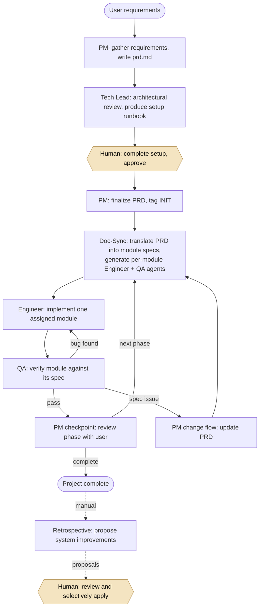

# Multi-Agent Software Development System

A team of six specialized AI agents that plan, build, and QA software through a
controlled, human-approved workflow. Each agent runs as an independent
[Claude Code](https://docs.claude.com/en/docs/claude-code) session with a single
responsibility, coordinating entirely through files on disk — no shared memory,
no black box. A human reviews and approves every handoff.

**It produces real software.** This system designed, implemented, and QA'd
**[TabVault](https://tab-vault.com)**, a deployed full-stack tab/notes manager.
→ [TabVault repo](https://github.com/LeonWu813/tab-management)

---

## How it works

Each agent does one job, sees only the files its role needs, and commits its work
to git before stopping. A `Stop` hook then prints the exact `claude --agent <name>`
command to run next — and the human decides whether to run it. Every handoff is an
atomic git commit, so any step can be rolled back cleanly.



*A human approval gate sits on every arrow — the hook suggests the next step; the
human runs it.*

---

## Design principles

The interesting engineering isn't the code the agents write — it's the system that
makes them produce correct software reliably. Four ideas do most of the work:

- **Single responsibility.** Each agent has one job, one input, one output, one
  handoff rule. Small, scoped agents are easier to constrain and to reason about, so
  a mistake stays contained.
- **Least-privilege information boundaries.** Each agent reads and writes only the
  files its role requires. The Engineer never sees the PRD; it sees its module spec,
  which carries forward just enough context. No agent sees everything.
- **Human in the loop at every handoff.** The system proposes the next action; the
  human approves before it runs. Nothing is applied without review.
- **Git as a rollback safety net.** Every handoff is an atomic commit, so any step
  is a clean point to revert to. Progressive-disclosure skills (lean router files
  that load detailed workflows only when needed) keep each agent's context
  token-efficient.

---

## The six agents

| Agent | Responsibility | Can write |
|-------|----------------|-----------|
| **PM** | Owns the PRD and all user communication | `prd.md`, project `status.md` |
| **Doc-Sync** | Translates the PRD into downstream specs; generates per-module Engineer/QA agents | `production.md`, module specs, generated agents |
| **Tech Lead** | Architectural advisory: feasibility, risks, setup runbook | `status.md` (reviews), `setup.md` |
| **Engineer** | Implements one assigned module | module source code, its own module status |
| **QA** | Verifies one module against its spec | its module's QA results |
| **Retrospective** | Proposes system improvements from project history (manual only) | `retrospective/` proposals |

Engineer and QA are base templates; Doc-Sync generates a thin per-module wrapper for
each, hard-coding which module spec and dependencies that instance is allowed to read.

---

## Run it

```bash
# Install agents, skills, and hooks
cp -r .claude/agents/ ~/.claude/agents/
cp -r .claude/skills/ ~/.claude/skills/
cp -r .claude/hooks/  ~/.claude/hooks/
# Merge the hook entries into ~/.claude/hooks.json (Stop and SubagentStop events)

# Start a new project
cd ~/projects/my-new-app
claude --agent pm
```

From there, follow the command each hook prints, approving each handoff.

---

## Repo structure

```
.claude/
├── agents/      # The six agent definitions (+ generated per-module wrappers)
├── skills/      # Reusable knowledge: router SKILL.md + workflows/references/templates/scripts
└── hooks/       # Handoff hook that prints the next command
ARCHITECTURE.md  # Full design spec — the deep dive
```

For the complete design — every agent's constraints, the skill architecture, the
sync rulebook, and the git/rollback conventions — see **[ARCHITECTURE.md](./ARCHITECTURE.md)**.

---

## Status

<!-- Be honest here — this section backs your "did you really build this?" answer.
     Edit to match what's actually running vs. specified. Example below. -->

The six agent definitions, skills, and handoff hooks are implemented and were used
end to end to build [TabVault](https://tab-vault.com). And more going on~
